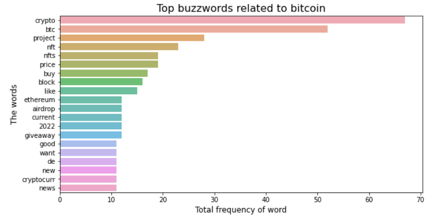

## Tweet Analysis

### What it does?

- This is the python code to analyze the tweets based on certain topic.

- This project basically shows what buzzwords are used in the tweets related to certain topic

### Prerequisites : 

- you need to have the api keys and token necessary for the API calls

- your twitter api application should have Essential level privilege for this to run.

### A Sample
